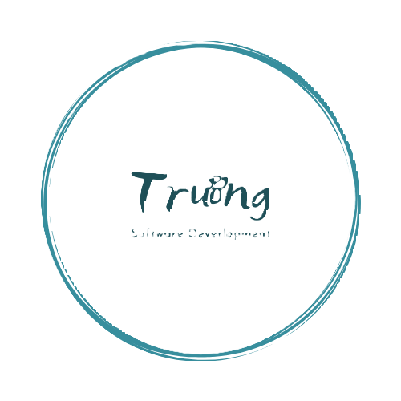

 

# 💫Intro

# 🌐Socials

  
  
  

# 💻Skills
## Front-end

&nbsp;

&nbsp;

&nbsp;

&nbsp;

&nbsp;

&nbsp;
 

## Back-end

&nbsp;

&nbsp;

&nbsp;

&nbsp;

&nbsp;

&nbsp;

&nbsp;

&nbsp;

&nbsp;

&nbsp;

&nbsp;

&nbsp;

&nbsp;

&nbsp;
 

## Others

&nbsp;

&nbsp;

&nbsp;

&nbsp;

&nbsp;

&nbsp;

&nbsp;

&nbsp;

&nbsp;
 

# 📊GitHub Stats :
 
 

 
<h2 align="left">📑 My Favorite Quote</h2>
 

---

